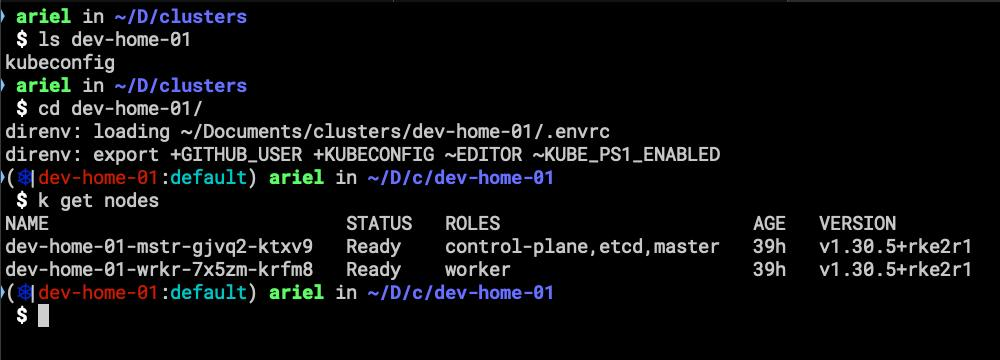

# rkci

## Why

I use Rancher to manage my Kubernetes clusters and I need to export the Kubeconfig file to access the clusters. I usually do this manually, but I wanted to automate the process.

## How

Just a little bash script to automate the process of exporting Kubeconfig file using Rancher CLI  export funcionality. This script with direnv is allowing me to have Kubernetes config in diferent directories and switch between K8s clusters easily.

Just copy the bash script, make  it executable and run it.

## Dependencies

- Rancher CLI ( already connected to a Rancher server )
- direnv
- gum (making bash scripting looks cool)
- oh-my-zsh and kube-ps1 plugin (optional)

## screenshot

